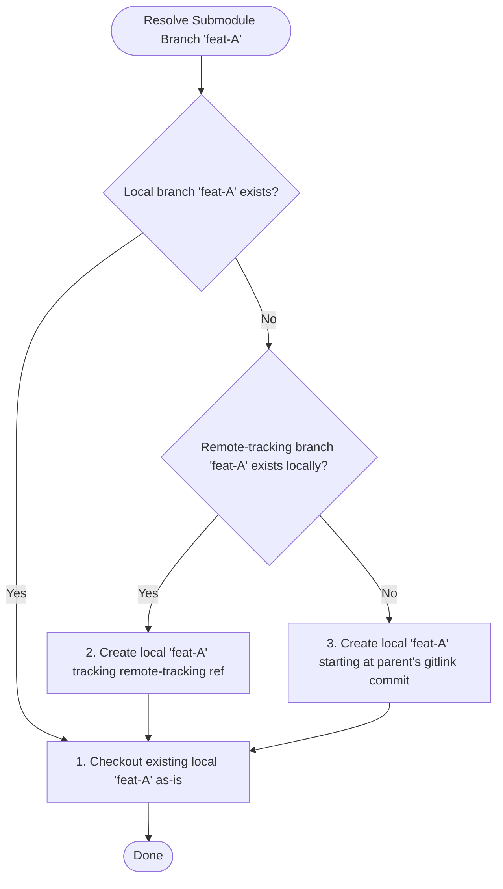
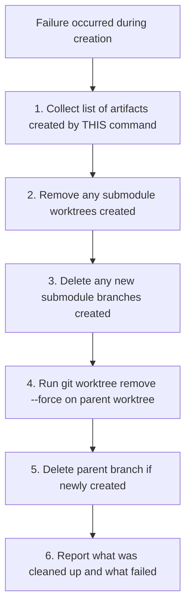

# Brainstorm: Unified DWIM Submodule Worktrees

Instead of introducing new configuration flags like `--submodule-start` and `--submodule-mismatch`, we can reuse the same **DWIM (Do What I Mean)** strategy that the root/parent repository uses. This makes the tool consistent, predictable, and configuration-free.

The design follows worktrunk's core principles: **data safety first** (fail rather than silently lose work), **local-first** (network touched only when the user explicitly asks), **convention over configuration** (sensible defaults with escape hatches), and **predictable outcomes** (the user always knows what happened).

---

## The Submodule DWIM Resolution Rules

When the parent repository is switched to branch `feat-A`, `wt` resolves the target branch for each submodule using the following priority order:



### Important: `wt start` vs `wt switch`

- **`wt switch`** — Uses the full 3-rule DWIM above. You're going somewhere that may already exist.
- **`wt start`** — Uses **Rule 3 only** (always create a new branch from the gitlink). You're creating something new; submodule branches should be new too. This mirrors the parent behavior where `start` always creates a new branch.

### 1. Existing Local Branch (Rule 1)
* **Behavior**: If the submodule already has a local branch named `feat-A`, `wt` checks it out.
* **Commit Mismatch**: If `feat-A` in the submodule points to a different commit than the parent's gitlink, `wt` checks it out anyway. The parent repository will show the submodule as modified/dirty (standard Git behavior). This is safe and preserves the developer's local branch state without silent resets.

### 2. Remote Tracking Branch — Local Refs Only (Rule 2 - DWIM)
* **Behavior**: If `feat-A` does not exist locally in the submodule, but a **local remote-tracking ref** exists (e.g. `origin/feat-A`), `wt` creates the local branch `feat-A` set up to track the remote ref, then checks it out.
* **No Network Access**: Rule 2 consults only local `refs/remotes/` in the submodule. It does not fetch from the remote. This is consistent with the project's local-first principle — the network is touched only when the user asked for it.
* **If Not Found Locally**: Falls to Rule 3 (create from gitlink). Users who have fetched the submodule's refs recently get DWIM; users who haven't get a new branch from a known-good commit.
* **Fetching Explicitly**: Users who want to fetch before resolution can run `git fetch --recurse-submodules` themselves, or use the `--fetch-submodules` flag (if added).

### 3. New Branch Creation (Rule 3)
* **Behavior**: If `feat-A` does not exist locally or as a local remote-tracking ref in the submodule, `wt` creates a new branch `feat-A` inside the submodule.
* **Starting Point**: The starting point for this new branch is the exact commit recorded by the parent's base commit (the gitlink). This ensures the newly created branch starts from a valid, known working state.

### `.gitmodules` Configuration: Branch Resolution Context

DWIM reads `.gitmodules` from the **target parent commit** (the tree of `feat-A`'s base commit), not the current checked-out version. This ensures the submodule URL and remote used for resolution match the branch being switched to.

**The `submodule.<name>.branch` field** is not used for DWIM resolution. This field describes what the submodule's upstream tracks on the remote — not what local branch the developer wants checked out in the submodule. The parent branch name is the sole input to DWIM, keeping resolution simple and predictable.

### Detached HEAD Parent

If the parent resolves to detached HEAD (tag, SHA, or orphan commit), there is no branch name to propagate. In this case `wt` runs `git submodule update --recursive` to sync submodules to their gitlink commits. No branch creation or switching occurs in submodules — predictable: no branch in the parent, no branch magic in submodules.

### Nested Submodules

DWIM resolution recurses into nested submodules (mirroring `--recursive` used elsewhere in the codebase). Pre-flight checks and rollback also recurse. Users can opt out with `--no-recurse-submodules`.

---

## Pre-Flight Checks (Preventing Half-Created States)

To ensure atomicity (either everything succeeds, or the environment remains completely untouched), `wt` will perform a **Pre-Flight Validation** step before running any creation commands.

### 1. Missing Submodule Commits
* **Check**: If a submodule requires a new branch starting at the gitlink commit (Rule 3), we check if the required commit hash exists in the submodule's local database.
* **Why**: If the user has fetched the parent repo but not the submodules, creating the branch will fail mid-way.
* **Fail Action**: Stop and report: 
  > `"Cannot create worktree. Submodule '<sub-name>' is missing commit '<hash>' locally. Run 'git fetch --recurse-submodules' first."`

### 2. Branch Already Active in Another Worktree
* **Check**: In Git, a branch cannot be active in more than one worktree at the same time. If a submodule has the branch `feat-A` already checked out in another worktree, creating the worktree will fail.
* **Why**: Git will raise a fatal error: `fatal: 'feat-A' is already checked out at...`
* **Fail Action**: Stop and report:
  > `"Cannot create worktree. Submodule '<sub-name>' already has branch 'feat-A' checked out at '<other-worktree-path>'."`

### 3. Submodule Directory Path Conflicts
* **Check**: Check if any of the target submodule paths (e.g. `../feat-A/<submodule-path>`) already contain files or directories in the filesystem that would block checkout.
* **Fail Action**: Stop and suggest using `--clobber` or manual cleanup.

### 4. Uninitialized Submodules
* **Check**: If a submodule listed in `.gitmodules` has not been initialized (no entry in `.git/config` and no checkout directory), the submodule's repository does not exist locally.
* **Why**: All submodule operations (checking branches, creating worktrees) require an initialized submodule with a cloned repository.
* **Fail Action**: Stop and report which submodules need initialization:
  > `"Cannot create worktree. Submodule '<sub-name>' is not initialized. Use --init to auto-initialize, or run 'git submodule init' first."`
* **`--init` Flag**: Accepts explicit user opt-in to run `git submodule init <sub-name>` for each uninitialized submodule. No auto-init — the user must consent.

---

## Atomic Rollback Strategy (Transactional Cleanup)

If the pre-flight checks pass but a failure occurs during the actual checkout/creation phase (e.g. unexpected disk write error, hook failure, process interruption):



### Artifact Tracking
The command maintains an in-memory "created artifacts" list throughout its execution: submodule worktrees, submodule branches, parent worktree, parent branch. Only artifacts on this list are touched during rollback — pre-existing state is never modified.

### Steps:
1. **Artifact Collection**: Throughout the creation phase, record each artifact as it is successfully created.
2. **Submodule Worktree Cleanup**: Iterate in reverse order through submodule worktrees that were created, run `git worktree remove --force` on each.
3. **Submodule Branch Cleanup**: Delete any local branches that were newly created in submodules (but do not touch pre-existing ones).
4. **Parent Worktree Cleanup**: Run `git worktree remove --force` on the newly created parent worktree.
5. **Parent Branch Cleanup**: Delete the parent branch if it was newly created by this command.
6. **Report Results**: After all rollback attempts, present a summary of what was cleaned up, what failed, and any manual cleanup steps needed.

### Rollback Failure Handling
Each rollback step is **best-effort**. If a step fails:
- The error is collected (not swallowed).
- Rollback continues to the next step — a failure to clean up one artifact does not prevent cleanup of others.
- After all steps, report a complete summary:
  > `"Rollback completed with errors. Cleaned up: <list>. Failed to clean up: <list with errors>. Manual cleanup may be required: <instructions>."`
- Never retry a failed step. One attempt per artifact, then report.

### Signal Handling
If the creation phase is interrupted by Ctrl-C (SIGINT), rollback runs the same cleanup. Signal-derived child exits are detected via `err.interrupt_exit_code()`, and rollback proceeds as above rather than charging through remaining creation steps.

---

## Other Worktrunk Operations & Submodule Behavior

### 1. Worktree Removal (`wt remove`)
When removing a worktree with initialized submodules, we must maintain strict data safety across all checked-out repositories.

* **Cleanliness Check (Parent + Submodules)**: Before starting removal, `wt` will check the status of the parent repo AND all submodules. If any submodule is dirty (contains modified or untracked files), `wt` fails and prompts for `--force` to prevent data loss.
* **Metadata Pruning**: After successfully removing the parent worktree via `git worktree remove --force`, `wt` runs `git submodule foreach --recursive 'git worktree prune'` from the primary worktree. This cleans up the orphaned submodule metadata in `.git/modules/<submodule-name>/worktrees/`.
* **Submodule Branch Deletion Safety**:
  If the user requested branch deletion (e.g. `wt remove <branch> --delete` or safe deletion is enabled):
  * **Rule**: Submodule branches are checked out and committed to separately. Deleting them blindly could lose submodule work.
  * **Safe-Delete Strategy**: `wt` will attempt to delete the submodule branch `feat-A` using a safe delete (`git branch -d`).
  * **Unmerged Branches**: If the branch contains commits that are not fully merged into the submodule's default branch:
    * Git will refuse deletion.
    * `wt` will catch this, **skip deleting** that specific submodule branch, and print a warning listing which submodule branches were kept to prevent data loss:
      > `"Warning: Submodule '<sub-name>' branch 'feat-A' is not fully merged. Skipping branch deletion to prevent data loss."`

---

### 2. Worktree Pruning (`wt step prune`)
* **Metadata Pruning**: When pruning stale/detached/merged worktrees, after pruning the parent worktrees, `wt` will also run `git submodule foreach --recursive 'git worktree prune'` to ensure all submodule databases are cleared of orphaned entries.
* **Safe Branch Deletion**: Similar to `wt remove`, if prune deletes a merged parent branch, it should also check and safely delete matching merged submodule branches where applicable.

---

### 3. Merging (`wt merge`)

When merging a parent branch `feat-A` into `main`, `wt` can recursively merge the corresponding submodule branches to keep the whole project history in sync locally.

#### Recursive Merging Flow (`wt merge`)
If the parent repo's `feat-A` branch is being merged into `main`:
1. **Identify Modified Submodules**: `wt` checks which submodules contain new commits on branch `feat-A` relative to the merge target.
2. **Recursive Submodule Merge**:
   For each modified submodule:
   * Switch the submodule to its target branch (e.g. the default branch `main`).
   * Merge the submodule's `feat-A` branch into `main`.
   * **Conflict Guard**: If a merge conflict occurs in any submodule:
     * `wt merge` halts immediately.
     * The parent merge is aborted.
     * The user is notified to resolve the conflict inside the submodule first.
3. **Local Push for Submodules**:
   * If the submodule merges successfully, `wt` commits the merge and performs a **local push** to the submodule's primary/common repository (`.git/modules/<sub-name>`), updating the submodule's primary target branch.
   * Just like the parent repository, `wt` does NOT push to the remote server `origin` automatically.
4. **Update Gitlink & Merge Parent**:
   * The new commit hash of the submodule's target branch is recorded in the parent repository's index.
   * `wt` merges the parent's `feat-A` branch into `main`.
   * `wt` pushes the parent repository locally to update the primary worktree (`.`).

The user can then push all parent and submodule changes to the remote servers in one go from their primary checkout using:
```bash
git push --recurse-submodules=on-demand
```

---

### 4. Pushing (`wt push`)

`wt push` pushes the parent branch's commits to the remote. For submodules:

* **Default**: `--recurse-submodules=no` — submodules are not pushed. This is the safe default consistent with the project's local-first principle: pushing to remotes is an explicit user action.
* **Flag**: `--recurse-submodules` (accepts `check`, `on-demand`, `no`, `only` — mirroring git's own flag) allows the user to control submodule push behavior explicitly.
